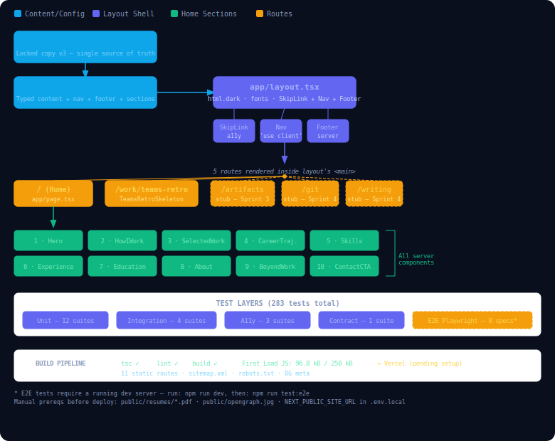

# Code Explainer
_Plain-English explanations of every file created or modified in each DEV session. Written by PROFESSOR. Append only — never rewrite existing sections._

---

## Sprint 0 — Session 1 (2026-06-25)
_Written by PROFESSOR after DEV session completed on 2026-06-25_

### Files Explained

---

#### `tailwind.config.ts`

**What it is:** The configuration file that teaches Tailwind CSS (a utility-based styling toolkit — a system where you apply pre-written design rules directly as HTML class names instead of writing custom CSS) which files to scan and which custom design tokens to make available.

**What it does:**

The file opens by importing the `Config` type from Tailwind — this is just a TypeScript (a version of JavaScript with built-in type checking) guard that catches typos in the config shape at edit time, not at runtime.

`darkMode: "class"` tells Tailwind to activate dark-mode styles only when a parent element has the class `dark` on it — as opposed to responding automatically to the user's OS preference. This means the `<html className="dark">` in `layout.tsx` is what actually switches the site into dark mode.

The `content` array lists three glob patterns (file-path wildcards) — `./app/**/*.{ts,tsx}`, `./components/**/*.{ts,tsx}`, and `./lib/**/*.{ts,tsx}`. Tailwind scans every matched file and collects every class name it finds; it then strips out all class names that were NOT found, keeping the final CSS bundle tiny. If you create a new folder outside these three paths and use Tailwind classes there, those classes will be absent from the production stylesheet.

`theme.extend.colors` maps friendly color names like `background`, `primary`, and `card` to CSS custom properties (CSS variables — reusable named values declared in `:root {}`). The `hsl(var(--background))` syntax means "read the raw hue-saturation-lightness numbers stored in the CSS variable `--background` and pass them to the color function." The actual numbers live in `globals.css`, not here.

`theme.extend.fontFamily` registers three font stacks: `font-sans` (Inter, the body text), `font-display` (Space Grotesk, for headings), and `font-mono` (JetBrains Mono, for code snippets). Each points to a CSS variable like `--font-sans` that `layout.tsx` injects at runtime via Next.js's font loader.

`theme.extend.borderRadius` derives three corner-rounding sizes from the `--radius` CSS variable (set to `0.75rem` in `globals.css`). Using subtraction (`calc(var(--radius) - 2px)`) means changing `--radius` in one place automatically adjusts all three sizes proportionally.

**Why it exists:** Without this file, Tailwind has no knowledge of the project's design token names (`primary`, `background`, `card`, etc.) or custom font stacks. Every component that uses `text-primary`, `bg-background`, or `font-display` would silently produce no style.

**How it connects:** This file is read by Tailwind's build step (via PostCSS, a CSS processing pipeline). It feeds token definitions into the generated stylesheet that every component in `app/` and `components/` relies on. The CSS variable values it references live in `globals.css`. The font variable names it uses are injected by `layout.tsx`.

**Real-world analogy:** Think of this as the brand guidelines manual for a design team — it defines what "primary blue" and "display font" mean so every designer (component) uses the same values without looking them up individually.

**What could go wrong:**
- If a new source folder is added (e.g., `src/sections/`) without updating the `content` array, Tailwind classes used in that folder will be stripped from the production build. The page will look unstyled in production but work fine in development (where Tailwind uses a different, unoptimized mode).
- Changing a color token name here (e.g., renaming `primary` to `accent`) will silently break every component that uses `text-primary`, `bg-primary`, etc. — Tailwind emits no error; the class simply has no effect.
- The `fontFamily` entries depend on CSS variables (`--font-sans`, `--font-display`, `--font-mono`) that are injected dynamically by Next.js's font loader in `layout.tsx`. If those variable names ever drift between the two files, the fonts fall back silently to `system-ui` with no error.
- `darkMode: "class"` means removing `dark` from the `<html>` tag in `layout.tsx` will revert the entire site to a light (effectively unstyled-for-dark) appearance instantly.

---

#### `app/globals.css`

**What it is:** The single global stylesheet that declares the site's design token values and defines three reusable CSS utility classes used across every component.

**What it does:**

The first three lines (`@tailwind base`, `@tailwind components`, `@tailwind utilities`) are Tailwind directives — instructions to the PostCSS build step to inject Tailwind's reset styles, any component-layer rules, and all utility classes at those positions in the final stylesheet.

The `:root {}` block declares eight **CSS custom properties** (named variables that any element on the page can read). These are the raw numbers behind the color token system: for example, `--background: 230 40% 4%` stores the hue (230°, a deep blue), saturation (40%), and lightness (4% — nearly black) of the page background. Notice these are channel triplets with no `hsl()` wrapper — `tailwind.config.ts` wraps them in `hsl(var(...))` when using them. `--radius: 0.75rem` sets the global corner-rounding baseline.

The `@layer base {}` block writes default styles for the `<body>` tag and all heading tags (`h1`–`h6`). `@apply` is a Tailwind shortcut that expands class names into their CSS equivalents — so `@apply font-sans antialiased bg-background text-foreground` gives the body the Inter font, smooth sub-pixel text rendering, the dark background color, and white foreground text. All headings get `font-display` (Space Grotesk) and `tracking-tight` (tighter letter spacing).

The `@layer utilities {}` block defines three reusable class names the design system depends on. `.glass` applies a semi-transparent dark background plus a CSS `backdrop-filter: blur(12px)` — the "frosted glass" look where content behind a panel appears blurred. `.glass-card` extends glass with a faint border and hover transition that brightens the border to the primary color on mouse-over. `.text-gradient` clips a white-to-cyan gradient behind text characters to produce the gradient headline effect; the `color: transparent` line is required because gradient is set as a background, and the text color must be transparent to let the background show through.

**Why it exists:** This file is the single source of truth for every color value, every corner radius, and the three reusable visual effects (glass, glass-card, text-gradient) used site-wide. Without it, the entire visual design collapses — components would render with no background color, no font assignments, and no glass or gradient effects.

**How it connects:** `layout.tsx` imports this file directly (`import "./globals.css"`), which makes it load on every page. `tailwind.config.ts` reads the CSS variable names declared here when it builds the color token mappings. Every component that uses classes like `bg-background`, `text-primary`, `.glass`, or `.glass-card` is ultimately pulling values defined here.

**Real-world analogy:** Think of this as the paint swatches and finish samples in an interior designer's kit — everything else in the project says "use primary blue" or "use the glass finish," and this file is where those are actually defined as real colors and real visual treatments.

**What could go wrong:**
- The `.glass` and `.glass-card` classes use `backdrop-filter: blur()`, which is not supported in some older browsers and requires the `-webkit-backdrop-filter` prefixed version (which is present). If the `-webkit-` line is ever removed, the blur will silently disappear on Safari.
- The `.text-gradient` class requires `color: transparent` to work. If a component overrides the text color via another class applied after (e.g., `text-white`), the gradient will disappear and the text turns white — no error, just a silent visual regression.
- The `:root` block has no `@media (prefers-color-scheme: dark)` variant — the site is always dark regardless of user OS preference, which is intentional given `darkMode: "class"` in `tailwind.config.ts`. Adding an OS-preference media query here without a corresponding light-mode token set would produce a half-themed appearance.
- Removing any `--*` variable from `:root` causes every component that uses the corresponding Tailwind token to render with no color (effectively transparent or browser-default), with no build error.

---

#### `app/layout.tsx`

**What it is:** The root layout file — the single wrapper that Next.js wraps around every page on the site, providing the shared `<html>` shell, font loading, and global metadata (the tab title and description search engines read).

**What it does:**

The imports section pulls in three things: `Metadata` (a TypeScript type from Next.js that shapes the `metadata` export), three font loader functions from `next/font/google` (Next.js's built-in tool for loading Google Fonts in a way that avoids layout shift and privacy leaks), and the global stylesheet.

Each font is configured with three options. `subsets: ["latin"]` limits the downloaded font to Latin characters (reduces file size). `display: "swap"` tells the browser to show fallback system fonts immediately, then swap in the custom font once downloaded — preventing invisible text during load. `variable` assigns a CSS custom property name (`--font-sans`, `--font-display`, `--font-mono`) that Tailwind's font stacks (in `tailwind.config.ts`) reference.

The `metadata` export is a Next.js convention — any `layout.tsx` or `page.tsx` can export this object to set the page's `<title>` tag and `<meta name="description">` content. These are the strings a search engine or browser tab displays.

The `RootLayout` function is a **React component** (a reusable unit of UI that returns HTML-like markup). It receives `children` — a placeholder representing whatever page or nested layout is being rendered inside it. It returns the full `<html>` element. The `className` on `<html>` does three things simultaneously: `dark` enables Tailwind dark mode, and the three `.variable` strings (e.g., `inter.variable`) inject the CSS variable names that make `font-sans`, `font-display`, and `font-mono` resolve to the actual loaded fonts.

**Why it exists:** Next.js requires exactly one root layout. Without it, no page renders — the framework has nowhere to inject the `<html>` and `<body>` tags. It also centralizes concerns that must apply to every page: fonts, the dark class, the tab title, and the global stylesheet import.

**How it connects:** This file imports `globals.css` (making all CSS tokens available site-wide) and wraps every file under `app/` — including `page.tsx` and `error.tsx`. The font variable class names it puts on `<html>` are the values that `tailwind.config.ts`'s `fontFamily` config reads. `app/page.tsx` becomes the `{children}` rendered inside the `<body>` here.

**Real-world analogy:** Think of this as the building's lobby — every visitor (page) must pass through it, and it provides the shared infrastructure (lighting, signage, elevator) that every floor relies on, so each individual floor doesn't have to set those things up itself.

**What could go wrong:**
- The `dark` class on `<html>` must stay for Tailwind dark-mode styles to activate. If it is removed (e.g., during a layout refactor), the entire site switches to an effectively unstyled light appearance with no warning.
- The three `.variable` class names (e.g., `inter.variable`) must stay on `<html>` for the CSS variables `--font-sans`, `--font-display`, and `--font-mono` to exist in the DOM. Removing any one of them causes all components using the corresponding `font-*` Tailwind class to silently fall back to `system-ui`.
- `import "./globals.css"` is the only place the global stylesheet is loaded. Moving or deleting this import removes all color tokens, glass effects, and base typographic rules from every page at once.
- The `metadata` object's `description` field is what appears in Google search result snippets. If it is left stale or truncated past ~160 characters, search engines may auto-generate a less favorable description.

---

#### `lib/site-config.ts`

**What it is:** The single source of truth for all personalised content on the site — names, URLs, copy, and call-to-action labels — defined as typed data so the TypeScript compiler catches any missing or misspelled field.

**What it does:**

The file starts by defining a **type** called `SiteConfig` (a TypeScript construct — a named description of what shape an object must have, checked at compile time rather than runtime). It lists every field the site config object is allowed to contain: top-level strings like `name`, `role`, `headline`, `subheadline`, `email`, `linkedinUrl`, and `githubUrl`, plus a nested `hero` object that holds all the Hero section's specific copy. The `subheadline?` inside `hero` has a `?` suffix, marking it as optional — a field that may or may not be present.

The `hero` sub-object holds the eyebrow label (the small pill badge above the headline), the headline split into four named segments (`headlineLead`, `headlineMuted`, `headlineTrailing`, `headlineAccent`), and two call-to-action objects each with a `label` and `href`. The headline is split rather than stored as one string so the Hero component can apply different colors to different segments (white, grey, and cyan respectively) while keeping the joined text identical to the locked headline copy.

The `siteConfig` constant is the actual data object — it is validated against `SiteConfig` at compile time. All string values match the locked copy from `docs/PORTFOLIO_CONTENT.md`.

Both the type and the constant are `export`-ed, meaning other files can import and use them.

**Why it exists:** Without this file, content values would be scattered as **magic strings** (literal text typed directly inside component files) — impossible to update in one place, invisible to the TypeScript type system, and prone to drift between components. Centralising here means changing a URL or headline requires editing exactly one file.

**How it connects:** `Hero.tsx` imports `siteConfig` directly and destructures (pulls out specific named fields from) `hero` and `subheadline` to populate every visible text element. Future components (Nav, Footer, About) will import the same object for `name`, `email`, `linkedinUrl`, and `githubUrl`. Test files import `siteConfig` to assert that specific fields exist and have the correct values.

**Real-world analogy:** Think of this as the content brief handed to a graphic designer — it lists the exact name, tagline, and button labels to use, so the designer (component) doesn't have to make up or remember any copy themselves.

**What could go wrong:**
- The headline segmentation (`headlineLead + headlineMuted + headlineTrailing + headlineAccent`) must concatenate to exactly the locked headline string. If any segment is edited without updating the others to compensate, the rendered `<h1>` text will drift from the locked copy — tests catch this, but only if they are run.
- The `hero.primaryCta.href` and `hero.secondaryCta.href` are both `"#"` (placeholder anchors). Until real section IDs exist, clicking these buttons scrolls to the top of the page — acceptable for Sprint 0, but a silent UX gap until filled in.
- The `SiteConfig` type marks `hero.subheadline` as optional (`?`). If a future component reads `siteConfig.hero.subheadline` expecting it to be populated and the value was never set (it currently isn't), that component will render an empty string with no error.
- Adding a new required field to the `SiteConfig` type without adding a corresponding value to the `siteConfig` constant will cause a TypeScript compile error — which is the desired behavior (it prevents silent omissions), but it will block the build until fixed.

---

#### `components/home/Hero.tsx`

**What it is:** The Hero section component — the full-screen opening panel of the portfolio that displays the eyebrow label, headline, subheadline paragraph, and two call-to-action buttons.

**What it does:**

The imports bring in two things: `ArrowRight` from `lucide-react` (a library of SVG icons packaged as React components — reusable pieces of UI) and `siteConfig` from `lib/site-config.ts`.

The component function starts with a single destructuring line that pulls `hero` and `subheadline` out of `siteConfig`. This is all the dynamic data the component needs — there are no props (values passed from a parent component); the component reads its data directly from the config.

The return statement describes the visual structure as **JSX** (a syntax that looks like HTML but is actually JavaScript that React converts into real DOM elements). The outermost `<section>` is `min-h-screen` (at least as tall as the viewport) and uses flexbox to center its content vertically and horizontally.

Inside, an absolutely positioned `<div>` with `bg-gradient-to-br from-background via-card to-background` creates a subtle dark gradient overlay across the full section background. This uses Tailwind's built-in gradient utilities with the custom color tokens, so no hex values appear in the component.

The eyebrow `<span>` renders `hero.eyebrow` styled as a small, letter-spaced, monospace pill badge with a faint cyan border and the `.glass` background effect.

The `<h1>` renders in four adjacent segments: `headlineLead` in white, `headlineMuted` ("and") in `text-slate-500` (a muted grey), `headlineTrailing` (a single space for correct word spacing), and `headlineAccent` ("Technical Execution") in `text-primary` (cyan). These four segments together form the full locked headline while allowing per-word color variation.

The `<p>` renders the `subheadline` text in `text-slate-400`.

The CTA (call-to-action) buttons are rendered as plain `<a>` anchor tags, not `<button>` elements, because they navigate to sections of the page (`href="#"`). The primary button gets a glowing cyan background. The secondary button uses the `.glass` class for the frosted-glass look. Both have `focus-visible:ring-*` classes for keyboard accessibility (a visible focus ring when tabbed to).

The `ArrowRight` icon inside the primary CTA has `aria-hidden="true"` — this tells screen readers (assistive software for users who cannot see the screen) to ignore it, since it is decorative.

**Why it exists:** This is the first thing every visitor sees. Without it, the home page renders completely blank. It is also the only component Sprint 0 ships as visible output.

**How it connects:** `app/page.tsx` imports and renders this component as the sole content of the home page. All text content flows in from `lib/site-config.ts`. Styling tokens (`text-primary`, `bg-background`, `.glass`) resolve through `globals.css` and `tailwind.config.ts`. The `ArrowRight` icon is sourced from the `lucide-react` package listed in `package.json`.

**Real-world analogy:** Think of this as the cover page of a printed portfolio book — it is the first impression, contains the designer's name and positioning statement, and has two buttons that say "show me the work" and "tell me how you build," guiding the visitor toward the content they care about most.

**What could go wrong:**
- Both CTA `href` values are `"#"` (placeholder). A visitor clicking "View Featured Work" will not navigate anywhere useful until the `#selected-work` section is built and the `href` updated in `site-config.ts`.
- The gradient overlay `<div>` uses `z-0` and the content container uses `z-10` (layering values). If another element is added to the section without explicit z-index, it could render beneath the gradient overlay and become invisible.
- The `<h1>` uses four sibling segments rather than one string. If `headlineTrailing` (currently a single space character `" "`) is accidentally emptied, the words "and" and "Technical Execution" run together with no space in the rendered output — a very subtle visual bug.
- The component has no loading or error state because it reads from a static config object — but if `siteConfig` is ever refactored to fetch data asynchronously (e.g., from a CMS), the component will need a loading skeleton and error boundary to avoid a blank or crashed hero.

---

#### `app/page.tsx`

**What it is:** The home page route file — the entry point Next.js renders when a visitor lands on the root URL (`/`) of the site.

**What it does:**

The file imports the `Hero` component and exports a single function called `Home`. That function returns `<Hero />` — nothing else.

This is intentional. In Next.js's App Router (the file-based routing system used here), every file named `page.tsx` inside the `app/` directory becomes a URL route. `app/page.tsx` maps to `/`. The file's sole job right now is to mount the Hero section. As more sections are built in later sprints, they will be imported and added here.

**Why it exists:** Next.js requires a `page.tsx` at `app/page.tsx` for the home route to exist. Without it, visiting `/` returns a 404. This file also enforces the architectural rule that pages are thin orchestrators — they import and arrange section components rather than containing visual markup themselves.

**How it connects:** This is the entry point of the rendering chain. Next.js picks it up as the `/` route, wraps it in `app/layout.tsx`, and renders `<Hero />` inside the `<body>`. `Hero.tsx` takes over from there.

**Real-world analogy:** Think of this as the table of contents page in a magazine — it doesn't contain the articles itself, it just tells the printer (Next.js) which articles (components) appear on this page and in what order.

**What could go wrong:**
- This file currently renders only `<Hero />`. Until the remaining section components (SelectedWork, Experience, etc.) are imported and added here, those sections simply do not exist on the page — no error, just missing content.
- If `Hero.tsx` is ever renamed or moved without updating this import path (`@/components/home/Hero`), the build fails with a module-not-found error. The `@/` prefix resolves to the project root via `tsconfig.json`'s path aliases.
- The file has no `export const metadata` — page-level metadata falls back to the root layout's metadata. If this page ever needs a distinct `<title>` (e.g., for SEO A/B tests), a `metadata` export must be added here.

---

#### `app/error.tsx`

**What it is:** The root error boundary page — the fallback UI that Next.js displays automatically whenever an unhandled JavaScript error occurs while rendering any page on the site.

**What it does:**

The first line, `"use client"`, is a Next.js directive (an instruction to the framework) that marks this component as a **Client Component** — meaning it runs in the browser, not on the server. Error boundaries must be client components in Next.js's App Router because they use browser-side React features to catch render errors.

The component accepts two props (values passed by Next.js automatically when an error occurs): `error` (the actual JavaScript Error object, with an optional `digest` field — a server-side error ID for log correlation) and `reset` (a function that tells Next.js to attempt re-rendering the failed page from scratch).

The rendered UI is a centered, full-height page with three elements: a heading ("Something went wrong"), a short explanatory sentence, and a "Try again" button. Clicking the button calls `reset()`. All styling uses the same Tailwind tokens and button classes as the rest of the site so the error page looks visually consistent.

**Why it exists:** Without this file, an unhandled render error in any component causes Next.js to display a generic, unstyled browser error or a blank page. This file ensures that any crash is caught gracefully and the user has a recoverable path — without losing the site's visual design.

**How it connects:** Next.js automatically associates `app/error.tsx` with the root layout, making it the catch-all error boundary for every page under `app/`. It does not need to be imported anywhere — the framework picks it up by filename convention. If a page-level error occurs (e.g., in `page.tsx` or `Hero.tsx`), Next.js unmounts the failed tree and mounts this component instead, passing in the error and reset function.

**Real-world analogy:** Think of this as the "We're sorry, something went wrong" page that airlines show when their check-in kiosk crashes — it does not fix the underlying problem, but it tells the user what happened, keeps the experience on-brand, and gives them a button to try again.

**What could go wrong:**
- The `error` prop (the JavaScript Error object) is received but never displayed to the user — this is correct for production (exposing raw error messages is a security risk), but it means there is no visible information for debugging without opening browser DevTools. If an error occurs during a demo, it will look identical regardless of the root cause.
- The `reset()` function re-attempts rendering from the same code that just failed. If the error is deterministic (e.g., a missing required config value), clicking "Try again" will immediately re-crash and loop. There is no logic to detect repeated failures or redirect the user elsewhere.
- This boundary catches client-side render errors but does NOT catch errors in API routes or server-side data fetching (those return HTTP error responses instead). A future sprint that adds server-fetched data will need per-page `error.tsx` files in the relevant sub-routes if granular recovery is required.

---

#### `package.json` (changes this sprint)

**What it is:** The project's dependency manifest — the file that records every external library the project uses and defines the shorthand commands (scripts) available to run in the terminal.

**What changed this sprint:**

Two scripts were added: `"test": "jest"` runs the full test suite in watch mode; `"test:run": "jest --ci"` runs it once and exits (used in automated pipelines where no interactive terminal is available). The `"typecheck": "tsc --noEmit"` script was also added — it runs the TypeScript compiler purely as a type-checker without generating any output files, used to catch type errors without building.

One production dependency was added: `"lucide-react": "^1.21.0"`. This is the icon library that `Hero.tsx` imports `ArrowRight` from. It is a production dependency (not a dev dependency) because the icons render in the browser for real users — they are not just used during development or testing.

The existing test toolchain (`jest`, `jest-environment-jsdom`, `@testing-library/react`, `@testing-library/jest-dom`, `@testing-library/user-event`, `jest-axe`, and related `@types/*` packages) was already present from the TEST agent session and was not changed.

**Why it exists:** npm (the package manager) reads this file to know which libraries to download when `npm install` is run. The `scripts` block provides aliases so the team can type `npm test` instead of remembering the full `jest` invocation with all flags.

**How it connects:** Every `import` statement in `src/`, `app/`, `components/`, and `lib/` that references a third-party package (e.g., `import { ArrowRight } from "lucide-react"`) depends on that package being listed here and installed in `node_modules/`. The scripts are invoked by CLAUDE.md's command table, CI pipelines, and the REVIEWER agent's audit steps.

**What could go wrong:**
- `lucide-react` is pinned to `^1.21.0` (caret range — compatible updates allowed). A future `npm install` on a new machine could pull in a higher `1.x` version that renames or removes the `ArrowRight` export, breaking the Hero build with a module-not-found error. Pinning to an exact version (`1.21.0`) would prevent this.
- The `"test"` script runs Jest in interactive watch mode, which hangs in CI environments. The `"test:run"` script (with `--ci`) is the correct command for automated pipelines — using the wrong script in CI will cause the pipeline to hang indefinitely.
- `lucide-react` is a production dependency. In a future sprint, if a tree-shaking (dead-code elimination) issue arises and the full icon library ends up in the bundle, the JS bundle size could increase substantially. The current 88 kB First Load JS is well within the 250 kB budget, but this is worth monitoring as more icons are added.

---

## Sprint 1 — Session 1 (2026-06-26)
_Written by PROFESSOR after DEV session completed on 2026-06-26_

### Architecture Diagram



> Source file: `docs/architecture-diagram.svg` — open in any browser or SVG viewer.

### Architecture Overview

How a browser request flows through the app:

```
Browser Request (e.g. GET /)
        |
        v
   Next.js Framework
        |
        v
  app/layout.tsx  ←── loads globals.css, three Google fonts
        |               renders: SkipLink + Nav + <main> + Footer + Analytics
        |
        v
  app/page.tsx  ←── assembles 10 section components in locked order
        |
        v
  Hero → HowIWork → SelectedWork → CareerTrajectory → Skills
  → Experience → Education → About → BeyondTheWork → ContactCTA
```

Where content comes from:

```
docs/PORTFOLIO_CONTENT.md  (locked copy — human source of truth)
        |
        v
lib/content/
  nav-footer.ts   (§2 Nav + §17 Footer copy)
  home.ts         (§4–§7: HowIWork, SelectedWork, CareerTrajectory, Skills)
  home-bio.ts     (§8–§12: Experience, Education, About, BeyondTheWork, Contact)
  teams-retro.ts  (§13–§14: TeamsRetro + TechnicalTwin copy)
  stubs.ts        (§16: Artifacts, Git, Writing stub copy)
  meta.ts         (§15: page titles + descriptions for all 5 routes)
        |
        v
lib/site-config-types.ts  (TypeScript type shapes — what every content object must look like)
        |
        v
lib/site-config.ts  (typed aggregator — imports all content, assembles siteConfig object)
        |
        v
Every component imports siteConfig and reads its section's data
```

Route structure (5 routes, all statically generated):

```
/                      → app/page.tsx          → 10 home sections
/work/teams-retro      → app/work/teams-retro/page.tsx  → TeamsRetroSkeleton
/artifacts             → app/artifacts/page.tsx  → StubPageLayout
/git                   → app/git/page.tsx        → StubPageLayout
/writing               → app/writing/page.tsx    → StubPageLayout

/sitemap.xml           → app/sitemap.ts  (auto-generated by Next.js)
/robots.txt            → app/robots.ts   (auto-generated by Next.js)
```

Shared layout components (rendered on every page via layout.tsx):

```
SkipLink  ──────────────────────────────────────────────────────┐
Nav (client island) ← ResumeDropdown + MobileMenu              │
  └── Container (width wrapper)                                 │  every page
<main id="main-content">                                        │
  └── page content (varies by route)                            │
Footer ← Container                                              │
Analytics (Vercel, invisible)                                   │
```

---

### Files Explained

---

#### `lib/site-config-types.ts`

**What it is:** The TypeScript type definitions file — a dictionary of shapes that describes exactly what every piece of content data in the site must look like, without containing any actual content values.

**What it does:**

The file exports a series of **type aliases** (TypeScript constructs that name the required shape of a data object). For example, `type Cta = { label: string; href: string }` says "a call-to-action must always have a text label and a URL — nothing more, nothing less." These types are building blocks that more complex types compose together.

The bulk of the file defines one type per section: `HowIWork`, `SelectedWork`, `CareerTrajectory`, `Skills`, `Experience`, `Education`, `About`, `BeyondTheWork`, `ContactCTA`, `TeamsRetro`, and so on. Each type names every field that section's content object must provide, along with its data type (string, array of objects, boolean, etc.).

At the bottom, `SiteConfig` is the master type — it lists every top-level key on the `siteConfig` object. The TypeScript compiler uses this to verify that `lib/site-config.ts` actually provides all the required fields before the code is allowed to build.

**Why it exists:** Without this file, content modules could omit required fields (e.g., forget to include `heading`) and components would silently receive `undefined`, causing blank sections or runtime crashes. The type file makes omissions a build error instead of a runtime surprise. It also lives in its own file (separate from `site-config.ts`) so content modules can import the types without creating circular dependencies (a situation where file A imports file B which imports file A).

**How it connects:** Every content module in `lib/content/` imports its relevant types from here (e.g., `import type { HowIWork } from "@/lib/site-config-types"`). `lib/site-config.ts` imports `SiteConfig` to validate the assembled `siteConfig` object. Components do not import from this file directly — they get their data via `siteConfig`.

**Real-world analogy:** Think of this as a standardized form template — it defines exactly which fields must be filled in and what kind of information goes in each box, so that whoever fills in the form (the content modules) cannot accidentally leave out required information.

**What could go wrong:**
- Adding a new required field to a type here (without a `?` optional marker) immediately causes a TypeScript build error in every content module that does not yet supply that field. This is the intended behavior — but it will block the build until all content modules are updated.
- If a type is changed here but the corresponding component reads a field by the old name, TypeScript will catch it at build time. However, if the component accesses a field via a dynamic key (e.g., `obj[someVariable]`), TypeScript may not catch the mismatch and the field will silently be `undefined`.
- Removing a type that is imported by a content module causes a build error in that module. Renaming a type requires a find-and-replace across all import sites — a missed import fails silently only if the old name happens to still resolve somehow.

---

#### `lib/site-config.ts` (Sprint 1 changes)

**What it is:** The typed aggregator file that was first created in Sprint 0 and expanded in Sprint 1 to import all section content from the `lib/content/` modules and assemble them into the single `siteConfig` object.

**What it does:**

The Sprint 0 version of this file contained both the type definition and the data inline. In Sprint 1, the type definition was moved to `lib/site-config-types.ts` and the content was split into six `lib/content/*` modules. This file was updated to import from both.

At the top, it imports the `SiteConfig` type and all section content objects. The `SITE_URL` constant reads the `NEXT_PUBLIC_SITE_URL` environment variable (a public configuration value that Next.js makes available to both server and browser code) and falls back to `"https://adwaitmulye.com"` if that variable is not set. The `??` operator is the **nullish coalescing operator** — it uses the right-hand value only when the left is `null` or `undefined`.

The `siteConfig` constant assembles every imported piece into one object. The top-level Sprint 0 fields (name, role, headline, hero, etc.) are written inline. All Sprint 1 fields (routes, nav, footer, howIWork, selectedWork, etc.) are passed in as shorthand properties (e.g., `howIWork` means `howIWork: howIWork` — JavaScript shorthand when the variable name matches the key name).

**Why it exists:** Components need a single import point for all content. If each component imported directly from its own content module, a later refactor (e.g., moving `howIWork` from `home.ts` to a new file) would require updating every component that uses it. Importing from `siteConfig` means only this file needs to change.

**How it connects:** Every component in `components/home/`, `components/layout/`, `components/teams-retro/`, and `components/shared/` that needs content imports `siteConfig` from this file. The five `app/*/page.tsx` route files also import it for their `metadata` exports. `lib/site-config-types.ts` provides the `SiteConfig` type that validates the assembled object at compile time.

**Real-world analogy:** Think of this as the production manager who receives scripts from all the writers (content modules), compiles them into a single master script, and hands the master to the director (the components). Writers can work independently; the director only ever talks to the production manager.

**What could go wrong:**
- `NEXT_PUBLIC_SITE_URL` defaults to `"https://adwaitmulye.com"` if unset. During local development this means `sitemap.xml` and OG URLs point to the production domain rather than `localhost` — harmless for production, but can confuse debugging if you inspect the generated sitemap locally.
- If a content module exports a symbol with the wrong name (e.g., `export const HowIWork` instead of `export const howIWork`), the import here fails silently at the JavaScript level but is caught at the TypeScript level because `SiteConfig` requires the correctly named field. Always run `npm run typecheck` after renaming exports.
- The file re-exports `SiteConfig` and all types from `site-config-types.ts` via `export * from "@/lib/site-config-types"`. This is a convenience so other files can do `import type { SiteConfig } from "@/lib/site-config"` instead of from the types file. If the re-export line is accidentally removed, those imports will break across the codebase.

---

#### `lib/content/nav-footer.ts`

**What it is:** The content module that holds all navigation and footer data — the five route URLs, the nav bar's links and resume entries, and the footer's colophon, site map, and social links.

**What it does:**

The file opens with two constants, `EMAIL`, `LINKEDIN_URL`, and `GITHUB_URL`, defined once at the top. This prevents the same URL strings from being typed multiple times in the same file — if a URL changes, one edit fixes all references.

The `routes` export is an object mapping five short names (`home`, `teamsRetro`, `artifacts`, `git`, `writing`) to their URL paths. Using named route constants rather than raw strings means components and other content modules can reference `routes.teamsRetro` instead of the literal string `"/work/teams-retro"` — a typo in the route constant is caught by TypeScript; a typo in a raw string is not.

The `nav` export defines everything the navigation bar needs: a brand link (the "Adwait Mulye" name at the top left), five nav links, a resume button label, and two resume PDF links. The nav links reference `routes.*` rather than duplicating the URL strings.

The `footer` export defines the copyright colophon text, a `siteMap` that re-uses `nav.links` (so the footer's site map and nav bar always stay in sync), three social link objects each with a `label`, `href`, and `ariaLabel`, and a bottom-line location/version string.

**Why it exists:** Nav and footer content appear on every single page via `layout.tsx`. Storing this data here rather than inline in the components means a URL or link label change requires editing this one file, not hunting through component JSX.

**How it connects:** `lib/site-config.ts` imports `routes`, `nav`, and `footer` from here and puts them on `siteConfig`. `Nav.tsx` reads `siteConfig.nav`; `Footer.tsx` reads `siteConfig.footer`. `lib/content/home.ts` also imports `routes` to build the "View Teams Retro" CTA href. `lib/content/meta.ts` imports `routes` to set each page's canonical path.

**Real-world analogy:** Think of this as the building directory posted at every floor — it lists every room on the building, the floor it's on, and how to contact the building manager, so every floor (page) can display the same accurate information without each floor maintaining its own copy.

**What could go wrong:**
- `footer.siteMap` directly references `nav.links` (not a copy of it). If `nav.links` is ever filtered or modified at runtime, the footer's site map changes too — but since both are static constants evaluated once at module load, this is only a risk if future code mutates the array in place.
- The resume PDF hrefs (`/resumes/Adwait_Mulye_PM-Technical.pdf`) point to files that must be manually placed in `public/resumes/`. Until those files exist, clicking Resume in the nav bar opens a 404. The build does not validate that linked PDF files exist.
- Social link `ariaLabel` strings ("LinkedIn profile", "GitHub profile", "Email Adwait") are the only text a screen reader announces for the icon-only social buttons in the footer. If these strings are removed or left generic (e.g., "link"), the buttons become inaccessible to screen-reader users.

---

#### `lib/content/home.ts`

**What it is:** The content module for home page sections 4 through 7 — How I Work, Selected Work, Career Trajectory, and Skills — plus a re-export of sections 8 through 12 from `home-bio.ts`.

**What it does:**

The file imports type shapes from `site-config-types.ts` and `routes` from `nav-footer.ts`, then defines and exports four data objects.

`howIWork` contains a heading, a subheading, and an array of three `Pillar` objects. Each pillar has an `icon` field set to a string name like `"Target"` or `"Code2"`. Notice this is a string, not an actual imported icon — the component (`HowIWork.tsx`) maintains a lookup table (`iconMap`) that converts the string name to the real icon component. This pattern keeps content modules free of React component imports.

`selectedWork` contains a heading and an array of `WorkCard` objects. The first card (`Teams Retro`) has real metrics, a quote, a tech stack, and a CTA href pointing to `routes.teamsRetro`. The remaining two cards have `placeholder: true` — the component uses this flag to render them as dashed outlines rather than full cards.

`careerTrajectory` contains the three career-lens blocks, an emphasis sentence split into three parts for bold rendering, two resume download links (pointing to PDFs in `public/resumes/`), and a SAFe note with a `mailto:` link.

`skills` contains a heading and four `SkillGroup` objects, each with a heading and a dot-separated prose string of skill names.

The final line uses a named re-export — `export { experience, education, about, beyondTheWork, contact } from "@/lib/content/home-bio"` — so callers can import all home-section content from one place (`home.ts`) without knowing the split exists.

**Why it exists:** The 200-line file cap (CLAUDE.md hard rule) prevents putting all home content in one file. Splitting at section 7/8 keeps both files under the limit while still providing a single import point via the re-export.

**How it connects:** `lib/site-config.ts` imports all ten home-section exports from this file (getting sections 8–12 transparently via the re-export). Components import nothing directly from here — all content reaches them through `siteConfig`.

**Real-world analogy:** Think of this as a chapter summary sheet in a textbook — it collects the key content from multiple chapters so readers (components) can get everything in one place, even though the content itself was written separately.

**What could go wrong:**
- The re-export on the last line (`export { ... } from "@/lib/content/home-bio"`) is a pass-through — it does not copy the values, it just makes them available under this module's namespace. If `home-bio.ts` is ever deleted or renamed without updating this re-export line, the build fails with a module-not-found error that appears to originate from `home.ts`, which can be confusing to trace.
- `selectedWork.cards[0].cta.href` points to `routes.teamsRetro`. If the `routes` import from `nav-footer.ts` ever changes the `teamsRetro` path, this CTA updates automatically — but if someone replaces `routes.teamsRetro` with a hard-coded string here, the two values can drift silently.
- Icon names in `howIWork.pillars[*].icon` are plain strings (`"Target"`, `"Code2"`, `"BrainCircuit"`). If a pillar is added with a typo in the icon name (e.g., `"target"` lowercase), `HowIWork.tsx`'s `iconMap` lookup returns `undefined` and the build will fail with a TypeScript error — but only because the `Pillar` type constrains `icon` to the three valid string literals. Adding a new icon name requires updating the union type in `site-config-types.ts` AND the `iconMap` in `HowIWork.tsx`.

---

#### `lib/content/home-bio.ts`

**What it is:** The content module for home page sections 8 through 12 — Experience, Education, The Bridge (About), Beyond the Work, and the Contact CTA — split from `home.ts` purely to stay under the 200-line file cap.

**What it does:**

The file exports five data objects matching the type shapes imported from `site-config-types.ts`.

`experience` contains a heading, a subheading, and an array of six `ExperienceEntry` objects, each with a time period, role title, company string, and description. The sixth entry (earliest roles) intentionally has an empty `company` string — the component checks for a truthy value before rendering the company line, so no blank line appears.

`education` contains two degree entries, each with degree name, institution, and year.

`about` contains the three paragraphs for "The Bridge" section. Paragraph 2 is split into `para2Pre`, `para2Bold`, and `para2Post` — three fields rather than one — so the component can wrap `para2Bold` in a `<strong>` tag for emphasis without using `dangerouslySetInnerHTML` (a React escape hatch that executes raw HTML and creates security risks).

`beyondTheWork` is a single heading and a single paragraph string.

`contact` contains a heading, two body lines describing job-search openness, and an array of three button objects each with a label, href, primary flag, and external flag. The `primary: true` flag marks the Email button as the filled/glowing CTA; the other two use the glass outline style.

**Why it exists:** This file holds the lower half of the home page content that would push `home.ts` past 200 lines. It is not meant to be a meaningful conceptual boundary — the split is purely mechanical to satisfy the line-cap rule.

**How it connects:** `lib/content/home.ts` re-exports everything from this file. `lib/site-config.ts` imports the exports indirectly via `home.ts`. Components access this content through `siteConfig.experience`, `siteConfig.about`, etc.

**Real-world analogy:** Think of this as a magazine that prints a very long article across two consecutive pages — the split is for printing constraints, not because the article is two different things.

**What could go wrong:**
- The `about.para2Pre`, `para2Bold`, and `para2Post` split must together reconstruct a grammatically correct sentence. If any segment is edited without checking the joined result, the paragraph can read awkwardly with a missing space or duplicated word.
- `contact.buttons` includes external links (LinkedIn, GitHub) that open in new tabs (`target="_blank"`) and an internal `mailto:` link. The `external` flag controls this behavior in `ContactCTA.tsx`. If a button's `external` value is set incorrectly, LinkedIn or GitHub could open in the same tab (breaking back-navigation) or the mailto could try to open in a new tab.
- Experience entry 5 has no `company` value (empty string). The component guards against this with a truthiness check. If a future entry is added with `company: undefined` instead of `company: ""`, TypeScript would flag it because the `ExperienceEntry` type requires `company: string` — keeping the data consistent.

---

#### `lib/content/teams-retro.ts`

**What it is:** The content module for the Teams Retro case study page and the Technical Twin section — both live under the `/work/teams-retro` route and are placeholders for Sprint 2 content.

**What it does:**

`teamsRetro` contains the case study page's header copy (eyebrow, heading, subhead), four real metric tiles (lines of TypeScript, test counts, hours), three content sections whose body text are marked as Sprint 2 placeholders, a demo area with placeholder text, and three CTA link objects (GitHub, Loom, Live Demo) all pointing to `"#"` pending Sprint 2.

`technicalTwin` contains the Technical Twin feature's heading, a badge string (`"in development"`), a body paragraph, and a note about which sprint it ships. This data exists now even though the feature does not — so the data shape is locked and typed before Sprint 5 implementation begins.

**Why it exists:** Defining the content structure now, even for placeholder content, means the TypeScript type system validates the shape immediately. Sprint 2 DEV can fill in the placeholder text without touching type definitions or component structure.

**How it connects:** `lib/site-config.ts` imports both exports and places them on `siteConfig.teamsRetro` and `siteConfig.technicalTwin`. `TeamsRetroSkeleton.tsx` reads `siteConfig.teamsRetro` to render the case study skeleton. Nothing renders `technicalTwin` yet — it is data waiting for a Sprint 5 component.

**Real-world analogy:** Think of this as a construction site hoarding board — it shows the project name, some real facts about the building (the metric tiles), and "Coming Soon" text where the full content will go, keeping the site honest and informative rather than blank.

**What could go wrong:**
- Three CTA links (`links` array) all point to `"#"`. If a user clicks "View on GitHub," the page scrolls to the top with no navigation. These must be updated with real URLs before the site is shared publicly — there is no build error or test gate preventing deployment with placeholder hrefs.
- The three `sections` bodies are marked `"[Full product overview — coming in Sprint 2]"`. These italicized placeholders will be visible to any visitor who reaches `/work/teams-retro` before Sprint 2 ships. The TeamsRetroSkeleton renders them in an `<p className="italic">` tag so they read as placeholder context rather than finished prose — but this only works if visitors understand the context.

---

#### `lib/content/stubs.ts`

**What it is:** The content module that stores the "coming soon" text for the three stub pages — Artifacts (`/artifacts`), Git (`/git`), and Writing (`/writing`).

**What it does:**

The file exports a single `stubs` object with three keys, each holding a `StubContent` shape: an `eyebrow` (the small monospace label at the top), a `title`, a `blurb` (descriptive paragraph), and a `statusNote` (the sprint timeline statement at the bottom).

**Why it exists:** All three stub pages use the same `StubPageLayout` component. Storing their individual content here — rather than inline in each `page.tsx` — means the stub pages stay thin route files with no inline copy, consistent with the rest of the architecture.

**How it connects:** `lib/site-config.ts` imports `stubs` and places it on `siteConfig.stubs`. Each stub page (`app/artifacts/page.tsx`, `app/git/page.tsx`, `app/writing/page.tsx`) spreads its section of `siteConfig.stubs` directly into `<StubPageLayout {...siteConfig.stubs.artifacts} />`.

**Real-world analogy:** Think of this as the "reserved" tent cards at a conference table — they hold the spot and tell attendees what is coming, without yet delivering the full presentation.

**What could go wrong:**
- The `statusNote` strings reference specific sprint numbers ("Coming in Sprint 3", "Coming in Sprint 4"). If those sprints slip or the content ships earlier, the notes will be stale on the live site. There is no automated mechanism to remove or update them — a manual edit to this file is required after each sprint that delivers the corresponding content.

---

#### `lib/content/meta.ts`

**What it is:** The content module that stores the SEO metadata — page title and description — for each of the five routes on the site.

**What it does:**

The file exports a `meta` object with five keys, one per route. Each entry is a `PageMeta` shape containing a `title` string (what appears in the browser tab and Google search headline), a `description` string (what appears in Google search snippets), and a `path` string referencing the corresponding route from `nav-footer.ts`.

**Why it exists:** Page titles and descriptions need to be both accessible as data (for the `metadata` export in each `page.tsx`) and consistent. Centralizing them here means a title change happens in one place and immediately propagates to both the `<title>` tag and the OpenGraph `og:title` tag.

**How it connects:** `lib/site-config.ts` imports `meta` and places it on `siteConfig.meta`. The root `app/layout.tsx` reads `siteConfig.meta.home` for its `metadata` export. Each sub-page (`app/work/teams-retro/page.tsx`, `app/artifacts/page.tsx`, etc.) reads its own `siteConfig.meta.*` entry for its per-page `metadata` export.

**Real-world analogy:** Think of this as the copy sheet an SEO agency hands to a web developer — it says exactly what title and description to use on each page, so nothing is improvised in the moment of wiring up the page.

**What could go wrong:**
- Descriptions are written to fit within ~160 characters (search engine truncation limit). If they grow beyond this during a content update, Google will truncate them in search results — no error, just a worse snippet appearance.
- The `path` field in each entry references `routes.*` from `nav-footer.ts`. If a route path changes (e.g., `/artifacts` becomes `/work/artifacts`), only the `routes` object in `nav-footer.ts` needs to change — the `meta` file picks up the update automatically because it reads from `routes`. This is the correct behavior, but only if the `path` field is always sourced from `routes` and never typed as a literal string.

---

#### `app/layout.tsx` (Sprint 1 changes)

**What it is:** The root layout file — updated in Sprint 1 to add `SkipLink`, `Nav`, `Footer`, Vercel Analytics, and a full OpenGraph and Twitter metadata block around the existing font and stylesheet setup.

**What changed:**

Sprint 0's layout rendered only `<body>{children}</body>`. Sprint 1 added four new imports: `Analytics` from `@vercel/analytics/react` (Vercel's privacy-respecting page-view tracker), `siteConfig` for metadata values, `SkipLink`, `Nav`, and `Footer`.

The `metadata` export was expanded from a simple title/description to include `metadataBase` (the base URL for resolving relative image paths), `openGraph` (the block of data social networks like LinkedIn read when someone shares a link), and `twitter` (Twitter/X card metadata). All values come from `siteConfig` rather than being hardcoded.

The `<body>` now renders four persistent elements around `{children}`: `<SkipLink />` at the very top (before Nav, so keyboard users encounter it first), `<Nav />`, `<main id="main-content">` wrapping the page content (the `id` is what `SkipLink` jumps to), `<Footer />`, and `<Analytics />` at the very end.

**Why it exists:** Nav and Footer must appear on every page without each page importing and rendering them individually. Putting them in the root layout means they are automatically present on every route, including any future routes added without DEV explicitly wiring them up.

**How it connects:** This file is the outermost wrapper for every page in the app. `SkipLink` links to the `id="main-content"` on `<main>`. `Nav` imports `siteConfig.nav`. `Footer` imports `siteConfig.footer`. `Analytics` emits a script tag that phones home to Vercel — it is a no-op in test environments where `__mocks__/vercel-analytics.tsx` stubs it out.

**Real-world analogy:** Think of this as the shell of a building's every floor — the lobby, elevator, and emergency exits (Nav, Footer, SkipLink) are permanent fixtures that appear on every floor without each floor needing to install them independently.

**What could go wrong:**
- `metadataBase` is set to `new URL(siteConfig.siteUrl)`. If `NEXT_PUBLIC_SITE_URL` is unset in a Vercel preview deployment, `siteUrl` falls back to `"https://adwaitmulye.com"` — so OG image URLs in preview deploys resolve to production, not the preview URL. This is harmless visually but means OG image previews for PR branches always show the production OG image.
- The `<Analytics />` component in test environments is a stub (`__mocks__/vercel-analytics.tsx`). If that mock file is ever deleted or mis-mapped in `jest.config.ts`, the real `@vercel/analytics` package (which uses ESM — a module format Jest cannot handle without transformation) will cause all layout-related tests to fail with a syntax error.
- `SkipLink` links to `#main-content`. The `<main>` tag has `id="main-content"`. If someone renames the `id` on `<main>` without updating `SkipLink`, the skip-to-content link becomes a broken anchor that scrolls nowhere — an accessibility regression with no visible error.

---

#### `app/page.tsx` (Sprint 1 changes)

**What it is:** The home page route — updated from a single `<Hero />` in Sprint 0 to ten section components rendered in locked order.

**What it does:**

The file imports ten components from `components/home/` and returns them wrapped in a React **fragment** (a `<>...</>` wrapper — a way to group multiple elements without adding an extra HTML element to the page). The order is fixed: Hero, HowIWork, SelectedWork, CareerTrajectory, Skills, Experience, Education, About, BeyondTheWork, ContactCTA.

No logic lives here — no data fetching, no conditionals, no state. The page file's only job is to declare what renders and in what order. All visual structure and content logic lives in the individual section components.

**Why it exists:** Next.js requires `page.tsx` to define a route. The thin-orchestrator pattern (pages only import and arrange, never implement) makes it easy to understand the home page's structure at a glance and easy to add, remove, or reorder sections without touching component internals.

**How it connects:** The root layout wraps this component in `<main id="main-content">`. Each imported section component reads its own slice of `siteConfig` independently. The locked order here is also the order tests assert — `home-page-s1.test.tsx` checks that all ten section headings appear in the DOM.

**Real-world analogy:** Think of this as a stage director's running order sheet — it lists all ten acts in sequence, but the director doesn't write the acts themselves. Each act is a separate script (component) that knows its own lines.

**What could go wrong:**
- The order of the ten sections is tested by the Sprint 1 test suite. Reordering imports here without updating `home-page-s1.test.tsx` will cause test failures — but the tests only check presence, not visual order, so a visual reordering could pass tests while breaking the intended narrative flow.
- All ten sections are **React Server Components** (they run on the server at build time, producing plain HTML) except for Nav (which is a Client Component). This means adding a client-side React hook (like `useState`) to any section component would require adding `"use client"` to that component — otherwise Next.js throws a build error. The current components have no hooks, so this is not yet a concern.

---

#### `components/layout/Container.tsx`

**What it is:** A tiny reusable wrapper component that centers content horizontally and adds consistent side padding at every screen width.

**What it does:**

The component accepts three optional props (values passed in from a parent): `children` (the content to wrap), `className` (extra Tailwind classes the caller wants to add), and `id` (an HTML id attribute for anchor linking or testing).

It renders a single `<div>` with three Tailwind classes: `max-w-[1200px]` (maximum width of 1200 pixels), `mx-auto` (center the div by setting automatic left and right margins), and responsive padding (`px-4` on mobile, `px-6` on medium screens, `px-8` on large screens). Any extra classes from `className` are appended. The `.trim()` removes any trailing spaces if `className` is empty.

**Why it exists:** Without this component, every section component would repeat the same `max-w-[1200px] mx-auto px-4 md:px-6 lg:px-8` class string. If the max-width or padding ever needed to change, it would require finding and updating every section. One component means one edit.

**How it connects:** Every section component (`HowIWork`, `SelectedWork`, `CareerTrajectory`, etc.) imports and uses `Container` as its width-constraining wrapper. `Nav.tsx` and `Footer.tsx` also use it. In practice, every visible section on the site passes through this component.

**Real-world analogy:** Think of this as the standard-width column that every article in a newspaper is typeset within — the newspaper has rules about column width so all articles look aligned on the page, and those rules are enforced in one place.

**What could go wrong:**
- The `max-w-[1200px]` value is a Tailwind **arbitrary value** (custom pixel value in square brackets) rather than a named scale token. If the design ever needs a different max-width, it must be changed here — but because it is a raw pixel value rather than a design token, the change does not cascade through any token system. Any component that bypasses `Container` and hardcodes its own max-width will not update automatically.
- Passing conflicting classes via `className` (e.g., `max-w-3xl`) can produce unexpected layouts because both classes apply and CSS specificity rules determine which wins. There is no deduplication — the caller is responsible for not passing classes that conflict with the base set.

---

#### `components/layout/SkipLink.tsx`

**What it is:** An accessibility-only "Skip to content" link that is invisible until a keyboard user tabs to it, then jumps them past the navigation directly to the main page content.

**What it does:**

The component is a single `<a>` tag pointing to `#main-content` (the `id` on the `<main>` element in `layout.tsx`). Its default state uses the `sr-only` Tailwind class — this visually hides an element by positioning it outside the visible viewport while keeping it reachable by screen readers and keyboard focus. The `focus:not-sr-only` class undoes that hiding the moment the element receives keyboard focus. The remaining `focus:*` classes style it as a small cyan pill in the top-left corner when visible.

**Why it exists:** Without this link, keyboard-only users (who navigate by pressing Tab rather than clicking a mouse) must Tab through every navigation item on every page before reaching the main content. For a five-link nav, that is six Tab presses wasted per page load. WCAG 2.1 (the international web accessibility standard) requires skip links for this reason. Its absence would cause the site to fail an accessibility audit.

**How it connects:** `app/layout.tsx` imports and renders this as the first child of `<body>`, before `<Nav />`. The `href="#main-content"` targets the `<main id="main-content">` element also in `layout.tsx`. The two must stay in sync — the link and its target are in the same file.

**Real-world analogy:** Think of this as the "skip preview" button at the start of a DVD menu — it's invisible unless you're navigating with the remote's arrow keys, and its only job is to let you jump straight to the movie without sitting through the menu.

**What could go wrong:**
- If `<main id="main-content">` in `layout.tsx` is ever given a different `id` (or the `id` is removed entirely), clicking this link scrolls to the very top of the page rather than skipping the nav. This is a silent accessibility regression — sighted mouse users won't notice, but keyboard users will find skip navigation broken.
- The component has no explicit `tabIndex`. Browsers focus anchor tags naturally, but if this link were ever changed to a `<div>` or `<span>`, it would need `tabIndex={0}` and an `onKeyDown` handler to remain keyboard-reachable.

---

#### `components/layout/Nav.tsx`

**What it is:** The sticky top navigation bar — a client-side React component that tracks scroll position, highlights the active route, and hosts the resume dropdown and mobile menu.

**What it does:**

The file opens with `"use client"` — this marks the component as a **Client Component** (one that runs in the browser and can use React hooks, as opposed to a Server Component that runs only at build time). This is necessary because Nav uses `useState` and `useEffect` (React tools for managing memory and side effects in the browser).

Two pieces of state are tracked: `scrolled` (whether the user has scrolled past 80% of the viewport height) and `menuOpen` (whether the mobile menu is open). A `useEffect` (a React hook — a function that runs after the component renders, used for browser-only operations) adds a scroll listener to the window. When `window.scrollY` exceeds 80% of the viewport height, `scrolled` becomes `true`. The cleanup function `return () => window.removeEventListener(...)` removes the listener when the component unmounts — preventing memory leaks (situations where browser memory is held unnecessarily after the component is gone).

When `scrolled` is `true`, the `<nav>` element switches from `bg-transparent` to `glass border-b border-white/10` — the frosted-glass backdrop appears. When `scrolled` is `false`, the nav is transparent over the hero section.

The desktop nav (hidden on mobile via `hidden md:flex`) maps over `siteConfig.nav.links` to render each link. The current page's link is highlighted with `text-primary underline` by comparing `link.href` to `pathname` (the current URL path, provided by the Next.js `usePathname` hook).

The hamburger button (visible only on mobile via `md:hidden`) toggles `menuOpen`. It has `aria-label="Open navigation menu"` and `aria-expanded={menuOpen}` — these are HTML accessibility attributes that tell screen readers whether the menu is currently open or closed.

**Why it exists:** Without Nav, visitors cannot navigate between the home page, Teams Retro, and stub pages. The scroll-triggered glass effect ensures the nav is readable over both the dark hero image (transparent state) and subsequent page sections (glass state).

**How it connects:** `app/layout.tsx` renders `<Nav />` once, making it persistent across all routes. Nav imports `Container` for width consistency, `ResumeDropdown` for the resume button, and `MobileMenu` for the overlay. All link labels and hrefs come from `siteConfig.nav`. `usePathname` from Next.js provides the current route for active-link highlighting.

**Real-world analogy:** Think of this as the header bar of a mobile banking app — it is always present at the top, tells you where you are (active page highlight), and has a hamburger icon on small screens that opens a full-screen menu.

**What could go wrong:**
- The `useEffect` dependency array is `[]` (empty), meaning the scroll listener is added once and never re-added. This is correct because `window` never changes — but if the event handler `onScroll` ever needed to reference props or state that changes, the empty array would cause it to use stale values (the classic React stale-closure problem).
- The scroll threshold is `window.innerHeight * 0.8` — 80% of the viewport height. If the Hero section is ever made shorter than 80vh (for example, on a very tall viewport on a small screen), the glass effect never triggers and the nav stays transparent over non-hero content.
- `Nav.tsx` is the only Client Component in the layout. Its JS ships to the browser. If additional interactive behavior is ever added here, the client bundle size grows. Because the component currently only uses two `useState` values and one `useEffect`, the impact is minimal — but it is worth remembering that every `"use client"` annotation has a bundle cost.

---

#### `components/layout/ResumeDropdown.tsx`

**What it is:** A small dropdown button inside the navigation bar that reveals two resume PDF links when clicked — one for the PM-Technical role, one for the TPM role.

**What it does:**

The component is a Client Component (`"use client"`) because it needs `useState` to track whether the dropdown is open and `useRef` (a React hook that holds a mutable reference to a DOM element — the container div — without triggering re-renders).

`open` state tracks whether the dropdown panel is visible. A `useEffect` runs only when `open` is `true`. It attaches two event listeners to the `document`: one for mouse clicks (to close the dropdown when the user clicks anywhere outside the container), and one for keyboard events (to close it when Escape is pressed). The click handler uses `containerRef.current.contains(e.target)` to check whether the click happened inside or outside the dropdown — if outside, `setOpen(false)` closes it. The `return` cleanup removes both listeners when `open` becomes `false` or the component unmounts.

The panel `<div>` uses Tailwind's `hidden`/`block` classes for show/hide rather than conditional rendering. This means the PDF `<a>` links are always present in the HTML DOM — keyboard users can Tab into them even when the panel appears visually hidden.

**Why it exists:** Recruiters need to download a resume. The portfolio targets two roles (PM-Technical and TPM), each with a different resume. A dropdown keeps the nav clean (one button instead of two) while surfacing both options on demand.

**How it connects:** `Nav.tsx` imports and renders this component, passing `nav.resumeLabel` ("Resume") as the button label and `nav.resumes` (the two PDF link objects from `siteConfig.nav`) as the dropdown items. The actual PDF files must exist at `public/resumes/Adwait_Mulye_PM-Technical.pdf` and `public/resumes/Adwait_Mulye_TPM.pdf`.

**Real-world analogy:** Think of this as the "Download" button on a file-sharing service that reveals two format options (PDF, DOCX) when clicked — clean interface until the user actually wants to download, then immediate access to both options.

**What could go wrong:**
- The dropdown panel uses `hidden`/`block` classes, not conditional rendering. This means both PDF links are in the DOM at all times. Screen readers and search engine crawlers can discover them even when the panel is visually hidden. This is generally fine for accessibility, but it means a bot could discover the resume URLs without a human click.
- The `useEffect` dependency array is `[open]` — it re-runs whenever `open` changes. This correctly adds listeners when the menu opens and removes them when it closes. If the dependency array were left empty (`[]`), the listeners would be added once and never removed, causing the click-outside handler to fire even after the dropdown is closed.
- The component does not trap focus (cycle Tab through only the dropdown items when open) the way `MobileMenu` does. This means a keyboard user could Tab past the dropdown panel's items and into the rest of the nav without the dropdown closing. This is minor but worth noting for a future accessibility pass.

---

#### `components/layout/MobileMenu.tsx`

**What it is:** A full-screen navigation overlay for mobile screen widths that traps keyboard focus, locks page scroll, and closes on Escape — meeting WCAG 2.1 modal dialog requirements.

**What it does:**

The component is a Client Component. It accepts five props: `open` (whether to render), `onClose` (callback to tell the parent Nav to close it), `links`, `resumes`, and `pathname`.

When `open` is `false`, the component returns `null` — it renders nothing at all, not even an invisible element.

When `open` becomes `true`, a `useEffect` runs three things: it saves the body's current `overflow` style and sets `document.body.style.overflow = "hidden"` (preventing the page behind from scrolling while the menu is open), attaches a `keydown` listener to the document, and moves browser focus to the first focusable element in the panel.

The keyboard handler handles two cases. Pressing Escape calls `onClose()`. Pressing Tab with Shift while on the first focusable element (backwards-wrapping) moves focus to the last item. Pressing Tab without Shift while on the last item (forwards-wrapping) moves focus to the first item. This is **focus trapping** — a requirement for modal dialogs under WCAG so keyboard users cannot Tab behind the overlay to invisible content.

The cleanup function restores `document.body.style.overflow` to what it was before the menu opened, removing the scroll lock.

The rendered panel uses `role="dialog" aria-modal="true" aria-label="Navigation menu"` — these ARIA attributes (Accessible Rich Internet Applications annotations) tell screen readers "this is a dialog; treat it as a modal."

**Why it exists:** On mobile widths, the desktop nav links are hidden (`hidden md:flex`). Without this overlay, mobile visitors have no way to navigate between pages. The WCAG attributes and focus trap ensure the overlay is usable by keyboard and screen-reader users, not just mouse users.

**How it connects:** `Nav.tsx` renders this component and controls its `open` state. When a link is clicked inside the menu, the `onClick={onClose}` prop closes the menu and lets Next.js's `<Link>` component navigate to the new route.

**Real-world analogy:** Think of this as the sliding tray menu that appears when you tap the hamburger icon in a mobile app — it covers the whole screen, blocks interaction with content behind it, and has a close button that slides it back away.

**What could go wrong:**
- The focus-trap logic queries `panelRef.current` for elements matching `'a[href], button:not([disabled])'`. If a new interactive element is added to the menu that is not a link or button (e.g., an `<input>` for search), it will not be included in the focus cycle. The selector must be updated if new element types are added.
- The component calls `firstLink?.focus()` after the `useEffect` runs. Because the `useEffect` runs after the browser paints, there is a one-frame delay between the panel appearing and focus moving into it. On slow devices, a user might Tab before focus is set, potentially landing focus outside the panel.
- `document.body.style.overflow = "hidden"` is stored and restored in the cleanup. If two overlays were open simultaneously (which cannot happen with the current single Nav, but could in a future sprint), the restoration could overwrite the other overlay's lock incorrectly.

---

#### `components/layout/Footer.tsx`

**What it is:** The site footer — a three-column grid rendered on every page via `layout.tsx`, containing the copyright colophon, a site map, and three social icon links.

**What it does:**

The file opens by importing three Lucide icons — `Briefcase`, `Code2`, and `Mail` — and defining an `iconMap` object that maps the social link label strings ("LinkedIn", "GitHub", "Email") to their corresponding icon components. This is the same string-to-component mapping pattern used in `HowIWork.tsx`. The comment explains why brand icons (LinkedIn logo, GitHub logo) are absent: `lucide-react` removed them.

The component renders a `<footer>` element with a top border and vertical padding, wrapping a `Container`. Inside, a CSS Grid creates three columns on medium-plus screens: colophon text on the left, site map links centered, and social icons on the right.

For each social link, the component looks up the icon by `s.label as keyof typeof iconMap` (a TypeScript assertion telling the compiler to treat the string as one of the three valid keys). It also checks `s.href.startsWith("http")` to determine whether the link is external — external links get `target="_blank" rel="noopener noreferrer"` to open in a new tab safely.

Every social link `<a>` uses `aria-label={s.ariaLabel}` (e.g., "LinkedIn profile") because the link contains only an icon with `aria-hidden="true"` — the `aria-label` is the only text a screen reader will announce for that link.

**Why it exists:** Without Footer, every page would end abruptly with no closing context, no copyright notice, and no social links — violating the visual design and removing key navigation for visitors who scroll to the bottom.

**How it connects:** `app/layout.tsx` renders `<Footer />` once, after `<main>`. All content (`footer.colophon`, `footer.siteMap`, `footer.social`) comes from `siteConfig.footer`, which is assembled from `lib/content/nav-footer.ts`. The `Container` component provides consistent width and padding.

**Real-world analogy:** Think of this as the masthead at the bottom of a newspaper — it credits the publisher, lists the major sections, and provides contact information, wrapping up the reading experience.

**What could go wrong:**
- The `iconMap` only covers three label strings: `"LinkedIn"`, `"GitHub"`, `"Email"`. If a fourth social link is added to `footer.social` in `nav-footer.ts` with a label not in `iconMap`, the `Icon` variable will be `undefined` and the component will throw a runtime error when trying to render `<undefined />`. The `as keyof typeof iconMap` type assertion suppresses the TypeScript warning but does not protect against the runtime crash.
- Social links that are external use `target="_blank"`. The `rel="noopener noreferrer"` is correctly included, which prevents the opened tab from accessing `window.opener` (a security best practice). If this attribute is ever removed, external links become a mild security risk — the opened page could navigate the original tab.
- The `footer.siteMap` is a direct reference to `nav.links` from `nav-footer.ts`. Adding a link to `nav.links` that should appear in the nav but NOT in the footer (e.g., a utility page) would require changing `footer.siteMap` to a separate array.

---

#### `components/home/HowIWork.tsx`

**What it is:** The "How I Work" section component — three glass-card columns each describing one of the three core product-management competencies, with an icon, title, body, and skill tags.

**What it does:**

The file imports three icon components from `lucide-react` and defines an `iconMap` object mapping the string names used in the content data to the actual icon components. Content modules store icon references as plain strings; this lookup converts them to renderable components without the content modules needing to import React.

The component reads `howIWork` from `siteConfig` and renders a section with a centered heading and subhead, then a responsive grid: one column on mobile, two on tablet, three on desktop.

For each pillar, it retrieves the icon from `iconMap[pillar.icon]`, wraps it in a cyan-tinted square badge, then renders the pillar's title, body, and an array of skill tags. Tags are `<span>` elements styled as small monospace pill badges with a faint border. Tags with a `subLabel` render an additional smaller grey line below the main label.

**Why it exists:** This section communicates the "three lenses" of the candidate's skill set. Without it, the home page jumps from the Hero straight to Selected Work with no explanation of methodology.

**How it connects:** `app/page.tsx` renders this as the second section (after Hero). Content comes from `siteConfig.howIWork` which originates in `lib/content/home.ts`. The `Container` component provides consistent width. The `iconMap` bridges the string-based content data to actual React components.

**Real-world analogy:** Think of this as the "What I do" panel on a consulting firm's website — three service boxes each with an icon, a headline, and a list of specific capabilities.

**What could go wrong:**
- If a pillar's `icon` value in `home.ts` is changed to a string not in `iconMap` (e.g., `"Wrench"`), `Icon` will be `undefined` and `<Icon />` will throw a runtime error. TypeScript prevents this because the `Pillar` type restricts `icon` to `"Target" | "Code2" | "BrainCircuit"` — but only if `site-config-types.ts` is kept in sync with `iconMap`.
- The section has `id="how-i-work"` and `scroll-mt-24`. The `scroll-mt-24` class adds 96px of top offset when the browser scrolls to this section via an anchor link, so the fixed Nav doesn't obscure the heading. If the Nav height ever changes from its current ~64px, `scroll-mt-24` may need adjustment.

---

#### `components/home/SelectedWork.tsx`

**What it is:** The "Selected Work" section — one real project card (Teams Retro) and two placeholder cards, rendered in a three-column grid.

**What it does:**

The component maps over `selectedWork.cards` and renders different markup depending on the `card.placeholder` flag. Placeholder cards get a dashed border and 60% opacity — visual shorthand for "coming soon." Real cards get the full `glass-card` treatment with a project image area, metrics bullet list, a pull quote blockquote, a tech stack line, and a CTA link.

The image area is a `<div role="img" aria-label={card.imageAlt}>` — an empty coloured box standing in for a real screenshot. Using `role="img"` with `aria-label` means screen readers announce "Teams Retro Dashboard" as if it were a real image.

Optional fields (`metrics`, `quote`, `stack`, `cta.href`) are each guarded by a `{field ? (...) : null}` conditional — nothing renders if the field is absent. This makes the same template work for both the full Teams Retro card and future cards that might omit some fields.

**Why it exists:** The Selected Work section is the primary evidence section — it shows visitors actual shipped work. Without it, the portfolio is a list of claims with no substantiation.

**How it connects:** `app/page.tsx` renders this third. Content comes from `siteConfig.selectedWork` from `lib/content/home.ts`. The Teams Retro card's CTA links to `routes.teamsRetro` (`/work/teams-retro`), which is a live route rendered by `app/work/teams-retro/page.tsx`.

**Real-world analogy:** Think of this as the portfolio pages in an architect's presentation — the first page shows a built project with photos and stats; the next pages have placeholder outlines labelled "project in development."

**What could go wrong:**
- The placeholder cards render with `opacity-60` and dashed borders. They are permanently visible to all visitors until replaced with real content. If Sprint 3 slips, these "Coming in Sprint 3" cards remain on the live site indefinitely — there is no expiry mechanism.
- `card.cta.disabled` is stored in content data but is not currently used to render a `disabled` attribute on any element — the placeholder cards render a `<span>` with the label text instead of a link. If a future developer checks `cta.disabled` expecting to find a disabled `<button>`, they will not find one.

---

#### `components/home/CareerTrajectory.tsx`

**What it is:** The "Career Trajectory" section — three career-lens cards, an emphasis sentence about AI-native PM identity, and two resume download buttons with a SAFe footnote.

**What it does:**

The component reads `careerTrajectory` from `siteConfig` (aliased to `c` for brevity). It renders three glass-card rows in a two-column grid: the `block.label` (bold, role title) in column 1 and `block.body` (description) in column 2.

Below the cards, an emphasis sentence renders `emphasisBold` (`"AI-Native PM"`) wrapped in a `<strong>` tag, flanked by `emphasisPre` and `emphasisPost` strings — the same split-field pattern used in `About.tsx` to avoid raw HTML in data.

Two resume download links render as `<a>` tags with `target="_blank"` pointing to PDF files in `public/resumes/`. The primary link has a filled cyan button style; the secondary has the glass outline style.

The SAFe footnote at the bottom renders a small grey sentence with an inline `mailto:` link, offering a separate resume for Product Owner conversations.

**Why it exists:** This section addresses the "which role?" question recruiters will have when looking at a candidate with 14 years of diverse experience. Without it, the portfolio leaves unclear whether the candidate is targeting PM-T, TPM, or SAFe PO roles.

**How it connects:** `app/page.tsx` renders this fourth. Content comes from `siteConfig.careerTrajectory` from `lib/content/home.ts`. The two PDF hrefs point to files in `public/resumes/` — those files must be manually placed there before the site goes live.

**Real-world analogy:** Think of this as the "career arc" slide in a job interview presentation — it narrates the journey from one title to the next and hands the interviewer a leave-behind document at the end.

**What could go wrong:**
- Both resume links open PDF files at `public/resumes/*.pdf`. Until those files are added to the repository and deployed to Vercel, clicking either button opens a 404. The build does not verify that linked static files exist.
- The `emphasisPre + emphasisBold + emphasisPost` split must read as a single coherent sentence. The space at the end of `emphasisPre` (`"And increasingly: "`) and the start of `emphasisPost` (`" — using agentic workflows..."`) are critical for readable output. A content editor could remove those spaces, causing words to collide without a TypeScript or build error.

---

#### `components/home/Skills.tsx`

**What it is:** The "Skills & Tools" section — four glass-card boxes each containing a skill group heading and a dot-separated prose string of skills.

**What it does:**

The component reads `siteConfig.skills` and renders a two-column grid on medium-plus screens. Each group is a `glass-card` with a heading and a `<p>` rendering the `skills` string — a single long string of dot-separated skill names. There is no splitting, tokenizing, or tooltip behavior: the string renders as-is.

**Why it exists:** ATS (applicant tracking systems) and human recruiters scan for specific skill keywords. A dedicated Skills section ensures keywords appear as clear text rather than buried in paragraphs.

**How it connects:** `app/page.tsx` renders this fifth. Content comes from `siteConfig.skills` from `lib/content/home.ts`. No sub-components are needed; the minimal structure means this file is entirely self-contained.

**Real-world analogy:** Think of this as the "Key Skills" box at the top of a resume — a compact, scannable list that lets a reader quickly verify relevant experience before reading the full career history.

**What could go wrong:**
- The `skills` string for each group is stored as a single prose string in `home.ts` (e.g., `"TypeScript · React · Next.js · ..."`). There is no maximum-length enforcement. If a skill group grows very long, the card will expand vertically and potentially unbalance the two-column grid, with one card much taller than its neighbor.
- Skill names are separated by `·` (middle dot) characters in the content string, not commas or bullet points. If a future editor copies and pastes from a tool that uses regular dots or hyphens, the separators will look inconsistent without any validation error.

---

#### `components/home/Experience.tsx`

**What it is:** The "Experience" section — a vertical timeline of six career entries, each displayed as a centered card on a faint vertical line, with a "Full work history" link at the bottom.

**What it does:**

The timeline is built with CSS positioning. A full-height `<div>` with `absolute left-1/2` and `w-px bg-white/10` creates the faint vertical line behind the entries, centered on the axis. Each entry card has a small cyan glowing dot above it (`h-3 w-3 rounded-full border-2 border-black bg-primary shadow-[...]`) positioned using the `z-10` stacking layer to float above the line.

Entry cards render `period` in monospace cyan, `role` in bold white, `company` (if truthy) in slate-400, and `description` in slate-500. The company check (`{entry.company ? ...}`) handles the final "earlier" entry which intentionally has an empty company string.

A final row after all entries renders the "Full work history →" link styled as a plain text link with the `ArrowUpRight` icon.

**Why it exists:** The experience section is the chronological proof of the career narrative told in CareerTrajectory. Without it, visitors see the summary claims but not the specific roles and achievements backing them.

**How it connects:** `app/page.tsx` renders this sixth. Content comes from `siteConfig.experience` from `lib/content/home-bio.ts`. The `historyLink.href` points to the PM-Technical resume PDF.

**Real-world analogy:** Think of this as the work history section of a LinkedIn profile — a vertical timeline of roles with dates, titles, companies, and brief descriptions.

**What could go wrong:**
- The timeline line is `absolute left-1/2` — it is centered on the section's max-width container. On very narrow screens (below the `md` breakpoint), the entry cards take up full width and the dot and line may not visually align with the card as intended. There are no explicit mobile-only positioning overrides.
- `experience.historyLink.href` points to a PDF in `public/resumes/`. Until the PDF exists, clicking "Full work history →" returns a 404. This is the third place in the codebase pointing to that PDF — the others being `CareerTrajectory.tsx` and `home-bio.ts`.

---

#### `components/home/Education.tsx`

**What it is:** The "Education" section — a minimal two-entry block showing degree, institution, and year for each of the two academic credentials.

**What it does:**

The component renders a `<section>` with a border-top, a centered heading, and a two-column grid on medium-plus screens. Each entry is three lines of plain text: degree name in bold white, institution in slate-400, and year in slate-500. No glass card, no icons, no extra decoration.

**Why it exists:** Education is a mandatory section for hiring submissions at many companies and a trust signal for technical roles (MS MIS from the University of Houston, BE Electronics from the University of Mumbai). Without it, ATS systems may auto-reject the profile as incomplete.

**How it connects:** `app/page.tsx` renders this seventh. Content comes from `siteConfig.education` from `lib/content/home-bio.ts`. The two-column grid is the only layout — there is no Container sub-wrapping other than the outer `Container`.

**Real-world analogy:** Think of this as the "Education" section at the bottom of a resume — brief, factual, and visually unobtrusive, giving the information without overshadowing the work experience.

**What could go wrong:**
- The two-column grid uses `md:grid-cols-2`. With exactly two entries this looks balanced. If a third credential were added (e.g., a certification), the third item would render in a single column, breaking the symmetric layout. The content type (`EducationEntry[]`) does not enforce a maximum count.

---

#### `components/home/About.tsx`

**What it is:** The "The Bridge" section — three paragraphs of personal narrative explaining the career context and AI-native methodology, with "AI-native PM" bolded in paragraph 2.

**What it does:**

The component reads `siteConfig.about` and renders a `<section>` with a centered heading. Three paragraphs follow. Paragraph 2 is assembled from three fields: `para2Pre` (plain text before the bold term), `para2Bold` ("AI-native PM" in `<strong>`), and `para2Post` (the rest of the sentence). This avoids `dangerouslySetInnerHTML` while still allowing inline bold text.

**Why it exists:** The About section is the narrative bridge between the career timeline (what happened) and the skills section (what tools). Without it, the portfolio reads as a list of facts without the connective reasoning that makes the candidate's positioning legible to a hiring manager.

**How it connects:** `app/page.tsx` renders this eighth. Content comes from `siteConfig.about` from `lib/content/home-bio.ts`. There are no sub-components or dependencies beyond `Container` and `siteConfig`.

**Real-world analogy:** Think of this as the personal statement at the top of a CV — it does not list facts but explains how the facts connect, and why this particular combination of experiences leads to this particular role.

**What could go wrong:**
- The three-part paragraph split (`para2Pre + para2Bold + para2Post`) must have correct spacing at its boundaries. `para2Pre` ends with a space (`"...I now operate as an "`), and `para2Post` begins without one (`" — running a self-designed..."`). Removing the trailing space from `para2Pre` would cause "an" and "AI-native PM" to collide in the rendered output. This is a content bug, not a code bug — TypeScript cannot detect missing whitespace in strings.

---

#### `components/home/BeyondTheWork.tsx`

**What it is:** A minimal human-interest section with a single heading and one paragraph about playing guitar for 25 years.

**What it does:**

The component renders a `<section>` with a centered heading and a single centered paragraph pulled from `siteConfig.beyondTheWork`. No glass cards, no icons, no tags — just text on the dark background.

**Why it exists:** Hiring managers and recruiters respond to candidates who show a human dimension beyond job titles. This section signals long-term commitment to developing a skill under pressure — a subtle analogy to the discipline required in technical product management.

**How it connects:** `app/page.tsx` renders this ninth. Content comes from `siteConfig.beyondTheWork` from `lib/content/home-bio.ts`. There are no dependencies beyond `Container`.

**Real-world analogy:** Think of this as the "Interests" section at the bottom of a resume — brief, genuine, and designed to make a human connection.

**What could go wrong:**
- The paragraph text is the full content of this section. It is long enough that on mobile widths it wraps across many lines. The `max-w-4xl` constraint prevents it from stretching to full screen width on large monitors — but on very wide screens (above 1200px), text will still be constrained by `Container`'s `max-w-[1200px]` but may still feel sparse without subheading support.

---

#### `components/home/ContactCTA.tsx`

**What it is:** The "Let's talk" closing section — a heading, two body lines describing job-search openness, and three equal-width contact buttons (LinkedIn, GitHub, Email).

**What it does:**

The component reads `siteConfig.contact` and renders a `<section>` with a top border and generous padding. Below the heading, two `<p>` tags render `contact.line1` and `contact.line2`. The three buttons map over `contact.buttons`.

For each button, a spread operator conditionally adds `target="_blank" rel="noopener noreferrer"` only when `btn.external` is `true` — `{...(btn.external ? { target: "_blank", rel: "noopener noreferrer" } : {})}`. This handles the case where LinkedIn and GitHub (external) open in new tabs while Email (a `mailto:` link, internal) stays in the same tab.

Button styling is conditional: `btn.primary` (Email) gets a filled cyan background with a glow shadow; the others get the glass outline treatment. All three use `flex-1` so they share equal width regardless of label length.

**Why it exists:** Without a contact section, a visitor who wants to reach out has no obvious next step after reading the portfolio. This is the final conversion point — the section that turns a curious visitor into a recruiter email.

**How it connects:** `app/page.tsx` renders this last (tenth). Content and button hrefs come from `siteConfig.contact` from `lib/content/home-bio.ts`. No sub-components are needed.

**Real-world analogy:** Think of this as the business card at the back of a portfolio book — after the visitor has seen everything, this is the page that says "here is how you reach me."

**What could go wrong:**
- The Email button uses `href="mailto:adwaitmulye@gmail.com"`. On mobile, this opens the device's default email client. On desktop, it opens the user's default mail app (which may not be set up, resulting in a confusing OS prompt). There is no fallback — if a visitor has no mail client configured, the button does nothing visible.
- `btn.external` controls whether `target="_blank"` is applied. If a future contact option is added with the wrong `external` value (e.g., `external: false` on a real external URL), it opens in the same tab and breaks back-navigation — no TypeScript or test guard prevents this.

---

#### `components/teams-retro/TeamsRetroSkeleton.tsx`

**What it is:** The skeleton layout for the Teams Retro case study page — a real header, metric strip, and placeholder content sections, waiting for Sprint 2's full copy.

**What it does:**

The component uses an `<article>` (the HTML element for self-contained content pieces like blog posts or case studies) rather than `<section>`. It renders a `<BackLink />` at the top (the "← Back to home" link), a centered `<header>` with eyebrow, `<h1>`, and subhead, then a four-column metric strip showing real values (5,055 lines, 87/87 tests, 44 Playwright cases, ~20–30 hours).

Below the metrics, the component maps over `t.sections` — an array of three section objects whose body text are Sprint 2 placeholders. Alternating sections get a dark background (`bg-black/20`) for visual rhythm. Finally, a "See it live" section renders a dashed placeholder box and three CTA links (GitHub, Loom, Demo — all pointing to `"#"` until Sprint 2).

**Why it exists:** The Teams Retro page must exist as a live, indexable URL before Sprint 2 so that the SelectedWork card's link is not a 404. The skeleton demonstrates the page structure and real metrics, making the page useful even before the full write-up is ready.

**How it connects:** `app/work/teams-retro/page.tsx` imports and renders this as its sole content. Content comes from `siteConfig.teamsRetro` from `lib/content/teams-retro.ts`. `BackLink` is imported from `components/shared/BackLink.tsx`.

**Real-world analogy:** Think of this as the "coming soon" landing page a startup publishes before launch — it shows the real logo and real key stats, but most content is "stay tuned" placeholders.

**What could go wrong:**
- All three CTA links (`links` array) point to `"#"`. If a visitor finds this page via search before Sprint 2, the GitHub, Loom, and Live Demo buttons all do nothing useful. There is no visual indicator that the links are placeholders — they appear as fully styled interactive buttons.
- The `idx % 2 === 1` alternating background pattern depends on the order of sections in `teamsRetro.sections`. Inserting a new section at the beginning would shift all the alternating backgrounds by one, potentially inverting the intended rhythm without any error.

---

#### `components/shared/BackLink.tsx`

**What it is:** A small reusable "← Back to home" navigation link used at the top of the Teams Retro page and all three stub pages.

**What it does:**

The component renders a Next.js `<Link>` (the framework's routing-aware anchor tag) pointing to `siteConfig.routes.home` (`"/"`). An `ArrowLeft` icon precedes the label text. The component accepts an optional `className` prop for callers that need spacing adjustments.

**Why it exists:** Sub-pages (Teams Retro, Artifacts, Git, Writing) need a way back to the home page. Rather than each page hardcoding its own back-link markup, this shared component ensures every back-link looks identical and points to the correct route.

**How it connects:** `TeamsRetroSkeleton.tsx` and `StubPageLayout.tsx` both import and render this component. The destination href comes from `siteConfig.routes.home`, not a hardcoded string.

**Real-world analogy:** Think of this as the "← Back" breadcrumb at the top of a Wikipedia article's sub-page — a small, consistent navigation cue that always takes you to the same parent level.

**What could go wrong:**
- The link label is hardcoded as the text `"Back to home"` rather than reading from `siteConfig.teamsRetro.backLabel`. The content data has a `backLabel` field (`"← Back to home"`) that is not currently used by this component. If the label text ever needs to change, two places require editing: `BackLink.tsx` and `siteConfig.teamsRetro.backLabel` (or the content data becomes misleading).
- The `ArrowLeft` icon is decorative and marked `aria-hidden="true"`. The link's accessible name is "Back to home" from its text content — sufficient for screen readers. If the text is ever removed and only the icon remains, an `aria-label` must be added.

---

#### `components/shared/StubPageLayout.tsx`

**What it is:** A reusable stub page shell used by the Artifacts, Git, and Writing pages — three routes that show "coming soon" content using identical layout.

**What it does:**

The component accepts four props: `eyebrow`, `title`, `blurb`, and `statusNote`. It renders a centered column with `max-w-3xl` (narrower than the 1200px max used by section components — appropriate for a focused reading layout). A `<BackLink />` appears at the top, followed by the eyebrow in monospace cyan, a large `<h1>`, a body blurb in slate-400, and a status note in slate-300.

**Why it exists:** Three routes need the same layout pattern. Without this shared component, each stub page would duplicate the same markup. A future change to the stub layout (e.g., adding a mailing list form) requires editing one file rather than three.

**How it connects:** `app/artifacts/page.tsx`, `app/git/page.tsx`, and `app/writing/page.tsx` all import this component and spread their respective content object from `siteConfig.stubs.*` directly as props (e.g., `<StubPageLayout {...siteConfig.stubs.artifacts} />`). Content values come from `lib/content/stubs.ts`.

**Real-world analogy:** Think of this as the standardized "Under Construction" notice template that a company uses on all its not-yet-launched product pages — same structure, different content filled in per page.

**What could go wrong:**
- The spread syntax (`{...siteConfig.stubs.artifacts}`) passes all fields of the stub content object as props. If `StubContent` in `site-config-types.ts` ever gains a new field, that field will automatically be passed as a prop to `StubPageLayout`. If `StubPageLayout` does not accept that new field in its prop type, TypeScript will catch it — but only on the next typecheck run after the type change.
- `Container` is passed `className="max-w-3xl"`. The `Container` component's base class is `max-w-[1200px]`; adding `max-w-3xl` means both max-width classes are present. CSS applies the one with higher specificity or (since both are utilities) the one that comes later in the stylesheet. In practice, Tailwind's JIT compiler generates utilities in a deterministic order, so `max-w-3xl` wins — but this relies on Tailwind's ordering behavior rather than an explicit override.

---

#### `app/work/teams-retro/page.tsx`

**What it is:** The route file for the Teams Retro case study page at `/work/teams-retro` — thin orchestrator that sets per-page metadata and renders the skeleton component.

**What it does:**

The file reads `siteConfig.meta.teamsRetro` into a local `m` constant for brevity. It exports a `metadata` object with full `openGraph` and `twitter` blocks — this page's title and description are different from the home page's, so they need their own `metadata` export. The `openGraph.type` is set to `"article"` (rather than `"website"`) because this is a case study, not a generic page.

The default export `TeamsRetroPage` renders `<TeamsRetroSkeleton />` and nothing else.

**Why it exists:** Next.js requires a `page.tsx` for every route. Without this file, `/work/teams-retro` returns a 404. The separate `metadata` export ensures the Teams Retro title and description appear correctly in Google and LinkedIn link previews rather than falling back to the home page metadata.

**How it connects:** This file is one level below `app/layout.tsx` in the Next.js routing tree — it still gets the shared Nav, SkipLink, Footer, and Analytics. Its `metadata` export overrides the root layout's `metadata` for this route specifically.

**Real-world analogy:** Think of this as the cover sheet for a specific chapter in a binder — it tells the reader (and search engines) what this section is about, without containing the section's actual content.

**What could go wrong:**
- The `openGraph.url` is constructed as `${siteConfig.siteUrl}${m.path}` — a template literal (a JavaScript string that embeds variable values). If `siteConfig.siteUrl` ever has a trailing slash AND `m.path` has a leading slash, the URL becomes `https://adwaitmulye.com//work/teams-retro`. The current values avoid this, but it is a common concatenation trap.

---

#### `app/artifacts/page.tsx`, `app/git/page.tsx`, `app/writing/page.tsx`

**What they are:** The route files for the three "coming soon" pages — each is identical in structure, differing only in which slice of `siteConfig` they consume.

**What they do:**

Each file reads its slice of `siteConfig.meta.*` into a local `m` constant, exports a `metadata` object with full OpenGraph and Twitter blocks, and renders `<StubPageLayout {...siteConfig.stubs.*} />`. The spread operator (`{...object}`) passes each field of the stub content object as an individual prop to `StubPageLayout`.

**Why they exist:** Next.js requires a `page.tsx` for each URL route. Nav links to `/artifacts`, `/git`, and `/writing` must not 404. Creating these stub routes also means they appear in `sitemap.xml`, making them discoverable by search engines from day one — even with placeholder content.

**How they connect:** All three are wrapped by the root layout (Nav, Footer, etc.). All three import from the same `StubPageLayout` component and the same `siteConfig`. The only differences between the three files are which `meta.*` and `stubs.*` keys are read.

**Real-world analogy:** Think of these as identical room booking confirmation pages — the template is the same, but each one is filled in with the details of a different room.

**What could go wrong:**
- The three files are near-identical boilerplate. If a change is made to one (e.g., adding `alternates.canonical`) but not the others, the pages drift. This is a maintenance-by-convention risk — there is no enforced sync mechanism. A future refactor could extract the metadata pattern into a helper function to eliminate the duplication.

---

#### `app/sitemap.ts`

**What it is:** The file that generates the `sitemap.xml` document that search engines use to discover and index all pages on the site.

**What it does:**

The file exports a default function that reads `siteConfig.siteUrl` and `siteConfig.routes`, then maps the five route paths to an array of **sitemap entries** — objects that Next.js converts to `<url>` blocks in the final XML file. Each entry has a `url` (the full absolute URL), `lastModified` (set to the build time), `changeFrequency` (how often search engines should re-crawl, set to `"monthly"`), and `priority` (the home page gets `1.0`; all other routes get `0.8`).

The ternary `path === "/" ? "" : path` prevents a double-slash at the root URL — without it, the home URL would be `https://adwaitmulye.com/`, which works but is inconsistent with how the other entries are formatted.

**Why it exists:** Without a sitemap, Google and Bing discover pages by following links. A sitemap guarantees all five routes are discovered immediately after first deploy, even if no external sites link to the sub-pages. Next.js converts this file into a valid XML sitemap automatically during `next build`.

**How it connects:** Next.js reads this file by convention (any `sitemap.ts` in the `app/` directory) and generates `sitemap.xml` at build time. `app/robots.ts` references the sitemap URL so crawlers know where to find it. `siteConfig.routes` provides the paths; `siteConfig.siteUrl` provides the domain.

**Real-world analogy:** Think of this as the index card a librarian files in the card catalogue — it doesn't contain the book's contents, but it tells the library system exactly where to find every book so patrons (search engines) can locate them.

**What could go wrong:**
- `lastModified` is set to `new Date()` at build time. Every build generates a new timestamp for every URL, even if the content of those pages did not change. Some SEO guides recommend only updating `lastModified` when content actually changes — but with a statically generated site that redeploys on every commit, this distinction is minor.
- Adding a new route to the site without adding it to `siteConfig.routes` (and therefore to the sitemap) means the new page will not appear in the sitemap until the omission is noticed and corrected. The build does not validate that all `page.tsx` files are covered by `siteConfig.routes`.

---

#### `app/robots.ts`

**What it is:** The file that generates the `robots.txt` document that tells web crawlers which parts of the site they are allowed to index.

**What it does:**

The function returns a single rule object: `userAgent: "*"` (applies to all crawlers) with `allow: "/"` (allow access to all paths). It also includes a `sitemap` pointer to `${siteConfig.siteUrl}/sitemap.xml`. Next.js converts this to a standard `robots.txt` text file at build time.

**Why it exists:** Without `robots.txt`, crawlers default to allowing all access — so this file's practical effect on the current site is minimal. However, the `sitemap` pointer is valuable: it tells crawlers exactly where the sitemap is, which can improve how quickly new pages are indexed after a deploy.

**How it connects:** Next.js reads this by convention and generates `/robots.txt` at build time. The `siteUrl` value comes from `siteConfig`, which reads `NEXT_PUBLIC_SITE_URL`. This is the only usage of the sitemap URL that is not inside `sitemap.ts` itself.

**Real-world analogy:** Think of this as the "visitors welcome — please sign in at the front desk" sign at an office building entrance — it tells outsiders they are allowed in and where to find the directory.

**What could go wrong:**
- The current rule allows all crawlers to access all paths. If a future sprint adds an admin route or a private API endpoint, that path should be added to a `disallow` list in this file. Forgetting to do so means the path will be indexed by search engines.
- `NEXT_PUBLIC_SITE_URL` defaults to `"https://adwaitmulye.com"` in production. In a preview deployment, the sitemap URL in `robots.txt` will still point to the production domain, not the preview URL. This is harmless (search engines generally ignore `robots.txt` on preview domains), but could mislead debugging.
